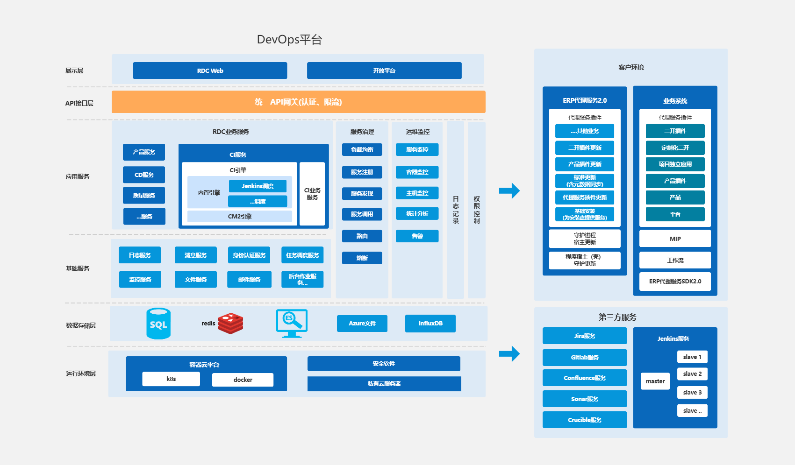

# 🛠️ 运维工程

> 探索前端开发中的 DevOps 实践与基础设施管理

## 🔄 DevOps<Badge type="tip" text="自动化" />



**DevOps**是软件开发与运维流程自动化的核心框架，通过持续集成、持续交付和持续部署（CI/CD）实现快速、高质量的软件交付。对于前端开发者，掌握 DevOps 流程可以显著提高团队协作效率和产品质量。

::: tip DevOps 核心目标

- **加速交付**：自动化流程缩短代码从开发到生产的周期
- **提高质量**：通过自动化测试和代码审查减少人为错误
- **协作优化**：打破开发与运维的壁垒，实现跨团队协作
- **快速反馈**：实时监控和日志分析帮助快速定位问题
  :::

### DevOps 流水线核心阶段

| 阶段                   | 工具                         | 前端应用                         |
| ---------------------- | ---------------------------- | -------------------------------- |
| **代码开发与版本控制** | Git, GitHub, GitLab          | 组件开发、代码审查、分支管理     |
| **持续集成 (CI)**      | Jenkins, GitLab CI, CircleCI | 自动构建、单元测试、代码质量检查 |
| **自动化测试**         | Jest, Cypress, Selenium      | 组件测试、E2E 测试、兼容性测试   |
| **持续交付/部署 (CD)** | ArgoCD, Spinnaker, Netlify   | 静态资源部署、环境配置、版本管理 |
| **监控与反馈**         | Prometheus, Grafana, Sentry  | 性能监控、错误跟踪、用户体验分析 |

### 工具链全景

| 工具类别       | 代表工具                       | 应用场景                           |
| -------------- | ------------------------------ | ---------------------------------- |
| **版本控制**   | Git, GitHub, GitLab            | 代码管理、分支策略、协作开发       |
| **CI/CD 平台** | Jenkins, GitLab CI, Travis CI  | 自动构建、测试、部署流程           |
| **容器化**     | Docker, containerd             | 应用打包、环境一致性、隔离运行     |
| **编排与管理** | Kubernetes, Docker Swarm       | 容器编排、服务发现、负载均衡       |
| **配置管理**   | Ansible, Terraform, Chef       | 基础设施即代码、环境配置、资源管理 |
| **监控与日志** | Prometheus, Grafana, ELK Stack | 性能监控、日志分析、告警系统       |
| **云平台**     | AWS, Azure, GCP                | 弹性计算、存储服务、全球分发       |
| **安全工具**   | HashiCorp Vault, Clair         | 密钥管理、镜像扫描、漏洞检测       |

### 前端 DevOps 最佳实践

1. **基础设施即代码 (IaC)**：使用 Terraform 或 AWS CloudFormation 定义环境，确保一致性
2. **不可变基础设施**：通过容器或虚拟机镜像替换而非修改现有环境
3. **左移安全 (Shift-Left Security)**：在开发早期集成安全扫描，如 npm audit 或 OWASP ZAP
4. **渐进式交付**：采用金丝雀发布逐步验证新版本，降低风险
5. **流水线即代码**：使用 Jenkinsfile 或 GitLab CI YAML 定义流程，版本化管理配置

```yaml
# 前端项目 GitLab CI 示例
stages:
  - install
  - test
  - build
  - deploy

install:
  stage: install
  script:
    - npm ci
  cache:
    paths:
      - node_modules/

test:
  stage: test
  script:
    - npm run lint
    - npm run test:unit
  dependencies:
    - install

build:
  stage: build
  script:
    - npm run build
  artifacts:
    paths:
      - dist/
  dependencies:
    - install

deploy:
  stage: deploy
  script:
    - aws s3 sync dist/ s3://my-frontend-bucket/
  only:
    - master
  dependencies:
    - build
```

## 🚢 Kubernetes <Badge type="tip" text="容器编排" />


**Kubernetes**（简称 **k8s**）是由 Google 工程师设计的开源容器自动化运维平台，它能够消除容器化应用程序在部署和伸缩时的许多手动操作。Kubernetes 可以将多台主机组合成集群来运行 Linux 容器，并帮助用户高效地管理这些集群，支持跨公有云、私有云以及混合云的环境。

::: tip Kubernetes 核心优势

- **自动化部署与扩展**：根据资源需求自动调整容器数量
- **自我修复能力**：自动替换失败的容器，重新调度节点
- **服务发现与负载均衡**：无需修改应用即可实现流量分发
- **存储编排**：自动挂载所选存储系统
  :::

在生产环境中，Kubernetes 提供了为工作负载大规模部署容器的编排和管理能力，它可以构建多容器的应用服务，调度或伸缩这些容器，并管理它们随时间变化的健康状态。Kubernetes 通过将容器分组为 **pod** 来解决容器增殖带来的问题，并且提供了一系列的组件和工具来帮助用户管理容器基础设施，包括自动布局、自动重启、自动复制和自动伸缩等功能。

### Kubernetes 核心组件

| 组件名称                    | 功能描述                                                        |
| --------------------------- | --------------------------------------------------------------- |
| **kube-apiserver**          | API 服务器，是控制平面的前端，公开了 Kubernetes API             |
| **etcd**                    | 一致且高可用的键值存储，用于所有集群数据的后台数据库            |
| **kube-scheduler**          | 监视新创建的、未指定运行节点的 Pod，并选择节点让 Pod 在上面运行 |
| **kube-controller-manager** | 运行控制器进程，如节点控制器、副本控制器、端点控制器等          |
| **kubelet**                 | 确保容器都运行在 Pod 中，维护容器的生命周期                     |
| **kube-proxy**              | 网络代理，维护节点上的网络规则，实现服务抽象                    |

```yaml
# 简单的Deployment示例
apiVersion: apps/v1
kind: Deployment
metadata:
  name: nginx-deployment
spec:
  replicas: 3
  selector:
    matchLabels:
      app: nginx
  template:
    metadata:
      labels:
        app: nginx
    spec:
      containers:
        - name: nginx
          image: nginx:1.14.2
          ports:
            - containerPort: 80
```

## 🐄 Rancher <Badge type="warning" text="集群管理" />

**Rancher** 是一个强大的开源平台，专为团队管理 Kubernetes 集群而设计，特别适合运行生产环境中的容器化应用。作为前端开发者，了解 Rancher 可以帮助你在 DevOps 流程中更好地部署和管理前端应用，尤其是在需要容器化和微服务架构的项目中。

::: tip Rancher 主要功能

- **多集群管理**：统一界面管理所有 Kubernetes 集群
- **简化部署**：通过 UI 快速部署应用和服务
- **权限控制**：细粒度的用户访问权限管理
- **资源监控**：实时监控集群资源使用情况
  :::

### Rancher 核心特性

| 特性                  | 描述                                                       |
| --------------------- | ---------------------------------------------------------- |
| **集群部署和管理**    | 在裸金属、云端等多种环境中部署和管理 Kubernetes 集群       |
| **Kubernetes 供应**   | 支持从托管提供商、计算节点或导入现有集群来供应 Kubernetes  |
| **集中式认证和 RBAC** | 提供跨所有集群的集中式认证和基于角色的访问控制             |
| **监控和警报**        | 提供集群资源的全面监控和警报功能，确保操作可见性           |
| **日志管理**          | 支持将日志发送到外部提供商进行分析和故障排除               |
| **Helm 集成**         | 通过应用目录与 Helm 集成，简化应用部署和管理               |
| **CI/CD 集成**        | 支持与外部 CI/CD 系统的集成，包括 Fleet 工具用于自动化部署 |

```yaml
# Rancher应用部署示例
apiVersion: apps/v1
kind: Deployment
metadata:
  name: frontend-app
  namespace: production
spec:
  replicas: 3
  selector:
    matchLabels:
      app: frontend
  template:
    metadata:
      labels:
        app: frontend
    spec:
      containers:
        - name: frontend
          image: your-registry/frontend:v1.2.3
          ports:
            - containerPort: 80
          resources:
            limits:
              cpu: '0.5'
              memory: '512Mi'
            requests:
              cpu: '0.2'
              memory: '256Mi'
```

对于前端开发者，Rancher 提供了以下几个关键优势：

1. 简化部署流程 ：通过 UI 界面或 API 快速部署前端应用，无需深入了解 Kubernetes 复杂配置
2. 环境一致性 ：确保开发、测试和生产环境的一致性，减少"在我机器上能运行"的问题
3. 版本控制 ：轻松管理不同版本的前端应用，支持快速回滚
4. 自动扩展 ：根据流量自动扩展前端服务实例数量，应对流量高峰
5. 集成 CI/CD ：与 Jenkins、GitLab CI 等工具无缝集成，实现前端代码的自动构建和部署

## 🔄 Jenkins <Badge type="tip" text="持续集成" />

**Jenkins** 是一个开源的自动化服务器，是目前最流行的持续集成、持续交付(CI/CD)工具之一。它可以帮助自动化软件开发过程中的各个部分，如构建、测试和部署，促进持续集成和持续交付。对于前端开发者，Jenkins 提供了一种可靠的方式来自动化构建流程，确保代码质量并简化部署过程。

::: tip Jenkins 核心优势

- **自动化构建与测试**：自动执行重复性任务，减少人为错误
- **丰富的插件生态**：超过 1000 个插件支持各种工具和平台集成
- **分布式构建**：支持跨多台机器分配构建任务
- **可扩展性**：可以根据项目需求进行定制和扩展
  :::

### Jenkins 在前端开发中的应用

| 应用场景         | 描述                                         |
| ---------------- | -------------------------------------------- |
| **代码质量检查** | 集成 ESLint、Prettier 等工具自动检查代码质量 |
| **单元测试**     | 自动运行 Jest、Mocha 等测试框架的测试用例    |
| **构建优化**     | 自动执行 webpack、Vite 等构建工具的构建过程  |
| **静态资源部署** | 将构建后的静态资源自动部署到 CDN 或服务器    |
| **版本发布**     | 自动化版本标记和发布流程                     |
| **跨浏览器测试** | 集成 Selenium 或 Cypress 进行自动化 UI 测试  |

### Jenkins Pipeline 示例

```groovy
// 前端项目 Jenkinsfile 示例
pipeline {
    agent any

    stages {
        stage('检出代码') {
            steps {
                checkout scm
            }
        }

        stage('安装依赖') {
            steps {
                bat 'npm install'
            }
        }

        stage('代码检查') {
            steps {
                bat 'npm run lint'
            }
        }

        stage('单元测试') {
            steps {
                bat 'npm run test'
            }
        }

        stage('构建') {
            steps {
                bat 'npm run build'
            }
        }

        stage('部署') {
            when {
                branch 'master'
            }
            steps {
                bat 'npm run deploy'
            }
        }
    }

    post {
        success {
            echo '构建成功，已部署到生产环境'
        }
        failure {
            echo '构建失败，请检查日志'
        }
    }
}
```

前端项目 Jenkins 最佳实践

1. 使用声明式 Pipeline ：使用 Jenkinsfile 定义构建流程，便于版本控制和代码审查
2. 缓存依赖 ：配置 npm/yarn 缓存，加速构建过程
3. 并行执行任务 ：将独立的任务（如测试和代码检查）并行执行，减少构建时间
4. 构建矩阵 ：针对不同浏览器/设备配置多个构建环境
5. 集成通知 ：与 Slack、钉钉等通讯工具集成，及时通知构建状态
6. 构建参数化 ：使用参数化构建，支持不同环境的部署选项

## 📊 监控与可观测性 <Badge type="warning" text="性能监控" />

前端应用的监控与可观测性是现代 DevOps 流程中不可或缺的一环。通过实时监控应用性能、错误率和用户体验，团队可以快速响应问题并持续优化产品。

::: tip 前端可观测性三大支柱

- **日志(Logs)**：记录应用运行时的详细信息
- **指标(Metrics)**：可量化的性能和业务数据
- **追踪(Traces)**：请求在系统中的完整路径
  :::

### 前端监控工具生态

| 工具类型     | 代表工具                   | 应用场景                               |
| ------------ | -------------------------- | -------------------------------------- |
| **性能监控** | Lighthouse, WebPageTest    | 页面加载性能、Core Web Vitals 指标监控 |
| **错误跟踪** | Sentry, LogRocket          | JavaScript 错误捕获、用户会话回放      |
| **用户体验** | Google Analytics, Hotjar   | 用户行为分析、热力图、转化漏斗         |
| **API 监控** | Postman Monitors, Runscope | 接口可用性、响应时间监控               |
| **基础设施** | Prometheus, Grafana        | 服务器资源、CDN 性能监控               |

### 前端可观测性最佳实践

1. **建立性能预算**：设定关键指标阈值，如首次内容绘制(FCP)、交互到绘制时间(TTI)
2. **实现错误边界**：使用 React Error Boundaries 或全局错误处理捕获前端异常
3. **采用 RUM 监控**：实际用户监控(Real User Monitoring)收集真实用户体验数据
4. **构建自定义仪表盘**：整合关键指标，提供业务和技术视角的统一视图
5. **设置智能告警**：基于历史数据和模式识别，减少误报，关注真正的异常

```javascript
// 前端性能监控示例代码
import { init } from 'some-monitoring-sdk'

// 初始化监控
init({
  apiKey: 'your-api-key',
  environment: process.env.NODE_ENV,
  release: 'v1.2.3',
})

// 自定义性能指标
performance.mark('app-initialized')
// ... 应用初始化逻辑 ...
performance.mark('app-ready')
performance.measure('app-initialization', 'app-initialized', 'app-ready')

// 发送自定义指标
const metric = performance.getEntriesByName('app-initialization')[0]
sendMetric('app_init_time', metric.duration)
```
