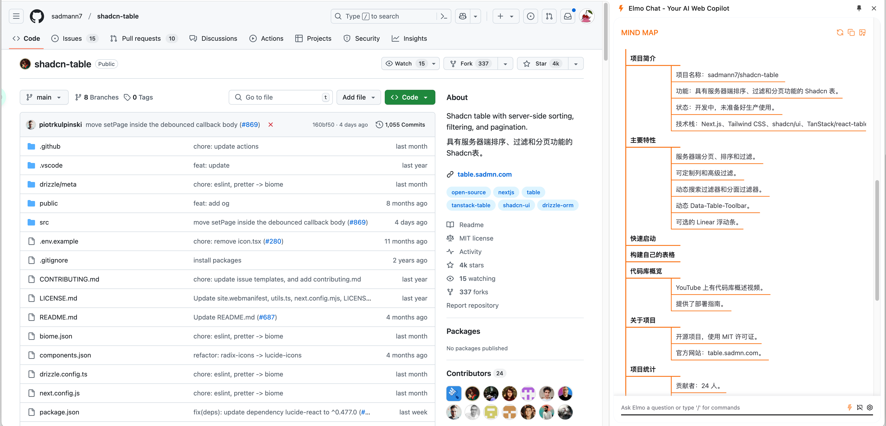
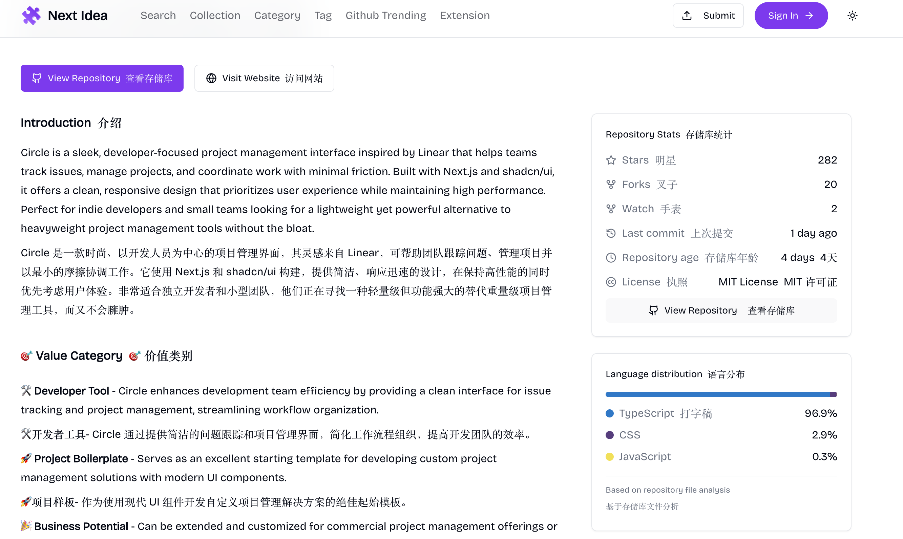
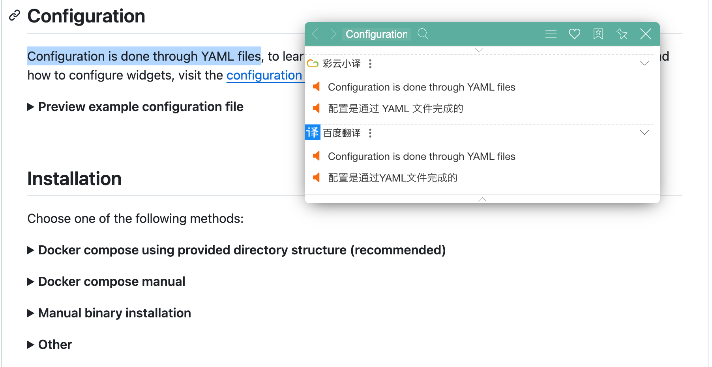
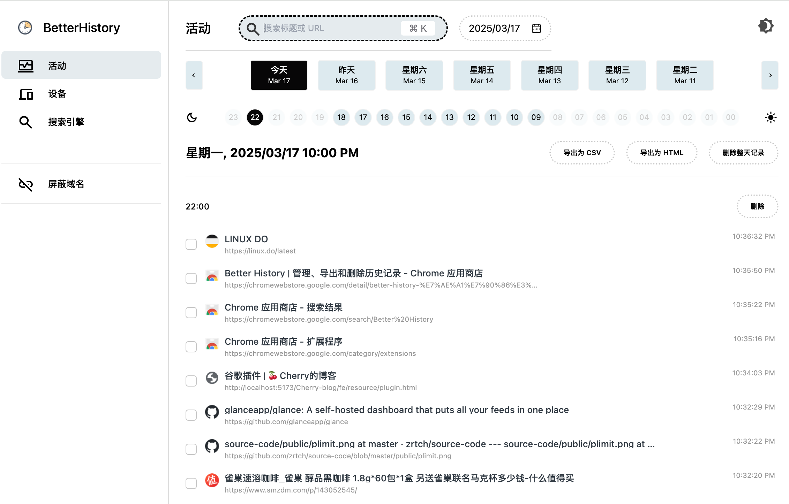

# 谷歌插件

## Elmo Chat

极简 AI 总结插件：https://www.elmo.chat/

前阿里副总裁**贾扬清 **的**Lepton AI**公司近期推出的 AI 产品，基于 Mixtral 8x7b 开源模型。EImo 可以将网页内容简要总结，帮助快速阅读和理解主要思想。
这类总结插件的本质就是获取网页内容，然后丢给大语言模型，通过 prompts 来生成总结和概要。

## 沉浸式翻译

双语对照网页翻译插件：https://immersivetranslate.com/zh-Hans/

你可以完全免费地使用它来实时翻译外语网页，PDF 翻译，EPUB 电子书翻译，视频双语字幕翻译等。还可以自由选择调用 DeepL、Gemini 等人工智能引擎来翻译上述内容。

## 沙拉查词

聚合词典专业划词翻译：https://saladict.crimx.com/

沙拉查词是一款专业划词翻译扩展，为交叉阅读而生。大量权威词典涵盖中英日韩法德西语，支持复杂的划词操作、网页翻译、生词本与 PDF 浏览。

## Better History 历史记录管理器

历史记录管理器：https://chromewebstore.google.com/detail/better-history-%E7%AE%A1%E7%90%86%E3%80%81%E5%AF%BC%E5%87%BA%E5%92%8C%E5%88%A0%E9%99%A4%E5%8E%86%E5%8F%B2/egehpkpgpgooebopjihjmnpejnjafefi

简洁的历史记录管理器：强大的搜索、批量导出、自定义删除、按天或小时删除，并阻止特定域名的历史记录。管理您的浏览历史变得简单高效。通过高级搜索工具（包括关键词和正则表达式）快速找到过去的访问记录。

## Cursorful 录屏工具

录屏工具：https://cursorful.com/

一款基于 Chrome 的免费的带有自动缩放功能的录屏工具，它支持自动跟随鼠标缩放、画面平移等功能，使录制过程更加流畅。用户可以通过 Cursorful 创建高质量的屏幕视频，Cursorful 非常适合用于产品 Demo 演示和操作指南。

<video src="https://cursorful.com/_nuxt/levelsio-16-9.BQqJP9-I.mp4" autoplay loop></video>
